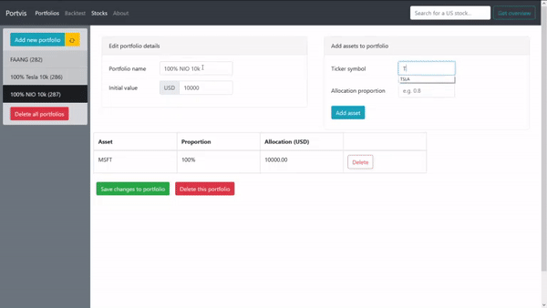

# Portvis

A full-stack web application that allows users to visualise and compare
historical returns of US stock portfolios, built with Spring Boot and React.

Inspired by [Portfolio Visualiser](https://www.portfoliovisualizer.com/).

> This application uses the word 'backtest' very loosely. It's really a data
> visualisation tool.

Low-res demo:



Screenshots are available at
[`/doc/`](https://github.com/jonjau/portvis/tree/master/doc) or
[here](https://jonjau.github.io/projects/portvis/).

## Functionalities

- Creating, displaying, updating, deleting portfolios of US stocks
- Visualising and comparing historical returns of portfolios over an arbitrary
  number of days
- Searching US stock symbols and displaying company summaries
- JWT-based user login and registration (using **insecure** cookies)

### To do

Backend:

- Enabling TLS (i.e. HTTPS)
- Unit and integration tests with mocking

Frontend:

- Better UI, using actual CSS (!!)
- Mobile-friendly layout
- Keyboard shortcuts
- Cleaner state management with React Context and/or Redux

Deployment:

- Setting up CI/CD

## Key dependencies

- AlphaVantage public API: daily stock price data
- MySQL: storing user and portfolio information
- Docker: containerisation

### Backend (`/server/`)

- Java 8
- Maven
- Spring Boot
  - Web Starter
    - Tomcat: embedded server
    - Jackson: JSON parsing
  - Data JPA Starter
    - Hibernate: ORM
- Spring Security: request filters and user authentication middleware
- Ehcache: in-memory caching of results from API calls
- Lombok: boilerplate-reducing annotations
- ModelMapper: conversion between models/DTOs/entities
- JJWT: manipulation of JSON web tokens

### Frontend (`/client/`)

- TypeScript 4.1
- Node, NPM/Yarn
- React
- Nginx: server for static files
- Bootstrap: CSS framework
- React Router: page navigation
- Formik (with Yup): input validation
- Axios: promise-based HTTP client
- Chart.js (with Moment): data visualisation library
- Lodash: convenience functions

## Running the application locally (development environment)

1. Ensure ports 3306 and 8080 are not being used.
2. Clone this repository.

### With Docker

Ensure the Docker service/daemon is running (e.g. by opening Docker Desktop),
then at the root directory:

```bash
docker-compose up
```

Assuming Docker Compose is installed (it's included in a Docker Desktop
installation).

Alternatively, running both the backend and frontend manually with Docker
also works, making sure [the environment variables](#environment-variables)
are properly set: `docker build` followed by `docker run` in both `/backend/`
and `/frontend/`.

The application will be accessible at <http://localhost>.

### Without Docker

- Ensure an instance of MySQL is running locally on port 3306, and that there
  is a connection to a database called `portvisdb` for a user named `portvis`
  with password `portvis`.
- Ensure Java 8+ and Maven is installed
- Ensure Node (and NPM or Yarn) is installed
- In `/backend/`, after setting
  [the environment variables](#environment-variables)
  (IntelliJ IDEA run configurations help with this):

  ```bash
  mvn spring-boot:run -f pom.xml
  ```

- In `/frontend/`,

  ```bash
  npm start
  ```

  or

  ```bash
  yarn start
  ```

The application will be accessible at <http://localhost:3000>.

#### Environment variables

Default setup for development:

| Variable            | Value              |
| ------------------- | ------------------ |
| CORS_ALLOWED_ORIGIN | `http://localhost` |
| MYSQL_DB_PORT       | 3306               |
| MYSQL_DB_USERNAME   | portvis            |
| MYSQL_DB_NAME       | portvisdb          |
| MYSQL_DB_PASSWORD   | portvis            |
| MYSQL_DB_HOST       | localhost          |

### Using the application

The application will not work on Chrome, because it immediately rejects the
setting of insecure cookies, rightly so. Firefox on the other hand is more
lenient... this application was mainly tested on Firefox.
